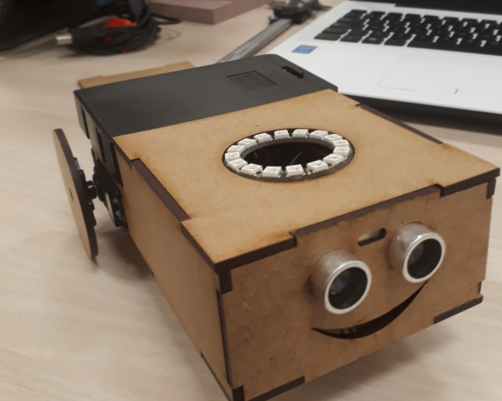

# RobotDuLab

## Présentation et objectifs

### Description du Projet :
Nous fabriquons un Robot mobile doté d'un capteur de présence programmé sur Arduino à partir du modèle RobotDuLab du LAB Aix bidouille. Le chassis est en bois medium imprimé à la découpeuse laser.

## Pré-requis
Connaissances de base en informatique. 

## Objectifs 
Comprendre la logique de fabrication des objets connectés présents au quotidien<br>
Etre capable d'agir, controller, modifier<br>
Etre capable de s'adapter, de répondre a des problèmes<br>
Développer la créativité et l'imagination (Libération de la créativité)<br>
Comprendre l'écosysteme d'un fablab<br>
Etre capable de réaliser un projet au sein d'un fablab<br>
Etre capable d'identifier les différents licences juridiques, d'usage, droit d'auteurs<br>
Etre capable de créer un objet connecté<br>
Etre capable de documenter un projet fablab<br>


### Materiel

2 x servomoteurs à rotation continue<br> 
1 x shield ultrason (capteur de présence)<br> 
2 x roues pour servomoteurs<br> 
1 x roue axe type bille<br> 
1 x interrupteur à glissière<br> 
1 x bloc 6 piles AA<br> 
1 x led ring (Neopixel ring)<br> 
1 x pistolet à colle<br> 
1 x fer à souder avec fil d’étain<br> 

1 x carte Arduino Uno<br>
1 x lot de cables dupont male/femelle<br>
1 x cable usb<br>
1 x adaptateur usb<br>

### Coût

Carte Arduino Uno : 10 EUR<br>
Planche bois medium 3mm : 2 EUR<br>
2X Servomoteurs Mini Servo FS5103R : 21 EUR<br>
Module Shield Ultrason HC-SR04 : 3,90 EUR<br>
2x Roue pour servomoteur FS5103R : 3,80 EUR<br>
Roue libre metal ball caster #955 : 3,30 EUR<br>
Interrupteur à Glissière Ayz0202 Pour Arduino : 3:00 EUR<br>
Lot Cables Dupont male et femelle : 3,99 EUR<br>
Boitier 6 piles AA :3,90 EUR<br>
Cable USB : 2,00 EUR<br>
Adaptateur USB : 2,00 EUR<br>

Coût total : Environ 60 EUR 


#### Temps Machine/Impression 3D :
Découpe laser sur planche bois medium
Utilisaton de la machine : 2 min pour imprimer les pièces

### Logiciels
Inkscape pour les plans de découpe laser<br>
Fritzing pour schémas de connectique

### Electronique / Programmation
Schéma de connexion électronique
<br>
Code Arduino pour le fonctionnement du Pixel Ring et les mouvement du Robot.
```c++


/*
  Ce programme de démonstration permet de faire fonctionner le robot équipé d'un Neopixel Ring d'une manière autonome
*/

#include <Servo.h> // librairie pour servomoteur 
#include <Adafruit_NeoPixel.h> // librairie pour NeoPixel Ring

#define broche_servoA 3 // broche servo A 
#define broche_servoB 5 // broche servo B 
#define trig 2 // broche trig du capteur US HC-SR04
#define echo 4 // broche echo du capteur US HC-SR04
#define ring 6 // broche Data du NeoPixel Ring 

const int MAX_SENS2=1000; // largeur impulsion pour position ANGLE_MIN degrés du servomoteur
const int ARRET=1490; // largeur impulsion pour position ANGLE_MEDIANE degrés du servomoteur
const int MAX_SENS1=2000; // largeur impulsion pour position ANGLE_MAX degrés du servomoteur

// classiquement : centrage sur 1500 - maxi sens 1 = 1000 et maxi sens 2 = 2000

// --- Déclaration des constantes des broches E/S numériques ---

long lecture_echo = 0; // variable sur 4 octets mesure de distance
long cm = 0; // variable sur 4 octets pour la conversion en cm

//--- Création objet servomoteur 
Servo servoA;  // crée un objet servo pour contrôler le servomoteur A
Servo servoB;  // crée un objet servo pour contrôler le servomoteur B 

Adafruit_NeoPixel strip = Adafruit_NeoPixel(16, ring, NEO_GRB + NEO_KHZ800); // 

// La fonction setup() est exécutée en premier et 1 seule fois, au démarrage du programme

void setup()   { // debut de la fonction setup()

// --- ici instructions à exécuter 1 seule fois au démarrage du programme --- 

  pinMode (broche_servoA,OUTPUT); // Broche broche_servo configurée en sortie
  pinMode (broche_servoB,OUTPUT); // Broche broche_servo configurée en sortie
  pinMode (trig,OUTPUT); // broche broche trig configurée en sortie
  digitalWrite(trig, LOW); // met un niveau logique , LOW (BAS) sur la broche trig
  pinMode(echo, INPUT);  // la broche echo est initialisée en entree
  Serial.begin(115200);  // initialisation de la liaison série à 115200 bauds
  strip.begin();
  strip.show(); // Initialisation du NeoPixel Ring
  rainbowCycle(10); // LED RING = Arc en ciel
} 
// fin de la fonction setup()
// ********************************************************************************

// la fonction loop() s'exécute sans fin en boucle aussi longtemps que l'Arduino est sous tension

void loop(){ // debut de la fonction loop()

   Avant();
   digitalWrite(trig, HIGH); // met un niveau logique , HIGH (HAUT) sur la broche trig
   delayMicroseconds(10); // attente pendant 10 microsecondes
   digitalWrite(trig, LOW);  // met un niveau logique , LOW (BAS) sur la broche trig.
   lecture_echo = pulseIn(echo, HIGH); //  lit la durée du niveau HAUT appliqué sur la broche echo
   cm = lecture_echo / 58; // conversion de la distance en cm
   Serial.print("Distance en cm : "); // affiche le message : "Distance en cm" sur le moniteur série
   Serial.println(cm); // affiche la mesure en cm avec retour à la ligne
   if (cm < 20) // si mesure < 20 cm => tourner sens aléatoire
   {
     if (millis()%2 == 1)
     {
        Droite(); // appel fonction Droite()
        delay (1000); 
     }
     else
     {
        Gauche(); // appel fonction Gauche()
        delay (1000); 
     }
   }
} // fin de la fonction loop() - le programme recommence au début de la fonction loop sans fin

void Stop() {
  if (servoA.attached()) servoA.detach(); // détache le servomoteur de la broche  = arret propre servomoteur
  if (servoB.attached()) servoB.detach(); // détache le servomoteur de la broche  = arret propre servomoteur
}

void Avant() {
  if (!servoA.attached()) servoA.attach(broche_servoA); // attache le servomoteur à la broche si pas attaché
  servoA.writeMicroseconds(MAX_SENS2); // crée impulsion - sens2
  if (!servoB.attached()) servoB.attach(broche_servoB); // attache le servomoteur à la broche si pas attaché
  servoB.writeMicroseconds(MAX_SENS1); // crée impulsion - sens1
  ringOff(); // appel fonction extinction de toutes les LED
  strip.setPixelColor(14, strip.Color(0,150,0)); // LED verte brillance moyenne.
  strip.setPixelColor(15, strip.Color(0,150,0)); // LED verte brillance moyenne.
  strip.setPixelColor(0, strip.Color(0,150,0)); // LED verte brillance moyenne.
  strip.show(); // Envoi des données vers le Ring.
}

void Arriere() {
  if (!servoA.attached()) servoA.attach(broche_servoA); // attache le servomoteur à la broche si pas attaché
  servoA.writeMicroseconds(MAX_SENS1); // crée impulsion - sens1
  if (!servoB.attached()) servoB.attach(broche_servoB); // attache le servomoteur à la broche si pas attaché
  servoB.writeMicroseconds(MAX_SENS2); // crée impulsion - sens2
}
void Gauche() {
  if (!servoA.attached()) servoA.attach(broche_servoA); // attache le servomoteur à la broche si pas attaché
  servoA.writeMicroseconds(MAX_SENS1); // crée impulsion - sens2
  if (!servoB.attached()) servoB.attach(broche_servoB); // attache le servomoteur à la broche si pas attaché
  servoB.writeMicroseconds(MAX_SENS1); // crée impulsion - sens1
  ringOff(); // appel fonction extinction de toutes les LED
  for(int i=2;i<5;i++){
    strip.setPixelColor(i, strip.Color(150,0,0)); // LED rouge brillance moyenne.
    strip.show(); // Envoi des données vers le Ring.
   }
}

void Droite() {
  if (!servoA.attached()) servoA.attach(broche_servoA); // attache le servomoteur à la broche si pas attaché
  servoA.writeMicroseconds(MAX_SENS2); // crée impulsion - sens1
  if (!servoB.attached()) servoB.attach(broche_servoB); // attache le servomoteur à la broche si pas attaché
  servoB.writeMicroseconds(MAX_SENS2); // crée impulsion - sens2
  ringOff(); // appel fonction extinction de toutes les LED
  for(int i=10;i<13;i++){
    strip.setPixelColor(i, strip.Color(150,0,0)); // LED rouge brillance moyenne.
    strip.show(); // Envoi des données vers le Ring.
   }
}

void ringOff()
{
   for(int i=0;i<16;i++){
    strip.setPixelColor(i, strip.Color(0,0,0)); // Toutes les LED éteintes
    strip.show(); // Envoi des données vers le Ring.
   }
}

void rainbowCycle(uint8_t wait) {
  uint16_t i, j;

  for(j=0; j<256; j++) { // 1 cycle couleur arc en ciel j<256*n = n cycles couleur arc en ciel
    for(i=0; i< strip.numPixels(); i++) {
      strip.setPixelColor(i, Wheel(((i * 256 / strip.numPixels()) + j) & 255));
    }
    strip.show();
    delay(wait);
  }
}

uint32_t Wheel(byte WheelPos) {
  WheelPos = 255 - WheelPos;
  if(WheelPos < 85) {
   return strip.Color(255 - WheelPos * 3, 0, WheelPos * 3);
  } else if(WheelPos < 170) {
    WheelPos -= 85;
   return strip.Color(0, WheelPos * 3, 255 - WheelPos * 3);
  } else {
   WheelPos -= 170;
   return strip.Color(WheelPos * 3, 255 - WheelPos * 3, 0);
  }
}
```


### Sources
Source RobotDuLab, schéma Fritzing et Code Arduino :
http://wiki.labaixbidouille.com/index.php/Accueil
